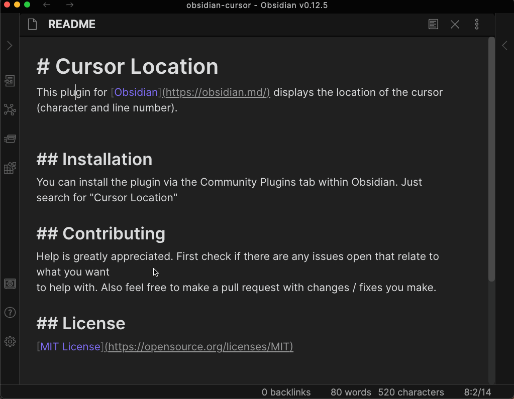
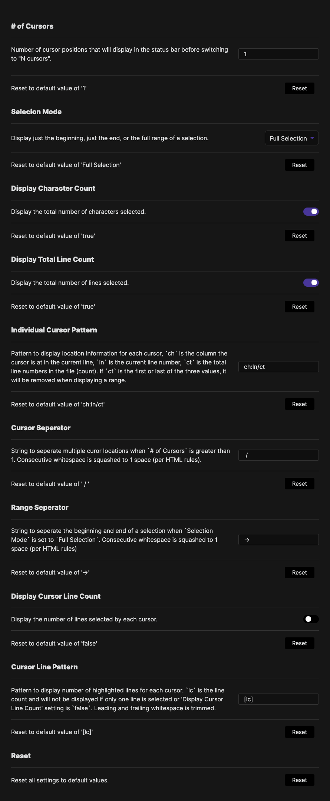

# Cursor Location  
This plugin for [Obsidian](https://obsidian.md/) displays the location of the
cursor (character and line number).

## Demo

## Settings
You can change the behavior via the Settings Tab.
- `# of Cursors`: Number of cursor positions that will display before switching
- to "N cursors"
- `Selection Mode`: How to display cursor position when a selection is made
  - `Beginning`: Show where cursor started
  - `End`: Show where a cursor is currently
  - `Full Selection`: Shows the range of the selection (`ch:line -> ch:line`).
    This will display a range that may go from later in the document to earlier
    if the selection is dragged backwards.
- `Display Character Count`: Display the total number of characters selected or not
- `Display Total Line Count`: Display the total number of lines selected or not
- `Individual Cursor Pattern`: Pattern to display location information for each cursor
  - `ch` is the column the cursor is at in the current line
  - `ln` is the current line number
  - `ct` is the total line numbers in the file (count)
  - If `ct` is the first or last of the three values, it will be removed when
    displaying a range.
- `Cursor Seperator`: String to seperate multiple curor locations when
  `# of Cursors` is greater than 1. Consecutive whitespace is squashed to 1
  space (per HTML rules).
- `Range Seperator`: String to seperate the beginning and end of a selection
  when `Selection Mode` is set to `Full Selection`. Consecutive whitespace is
  squashed to 1 space (per HTML rules).
- `Reset`: Reset all values to the default settings

### Default Settings

## Installation
You can install the plugin via the Community Plugins tab within Obsidian.
Just search for "Cursor Location"

## Contributing
Help is greatly appreciated. First check if there are any issues open that
relate to what you want to help with. Also feel free to make a pull request
with changes / fixes you make.

## License
[MIT License](https://opensource.org/licenses/MIT)
