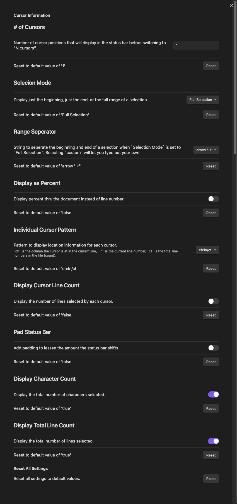
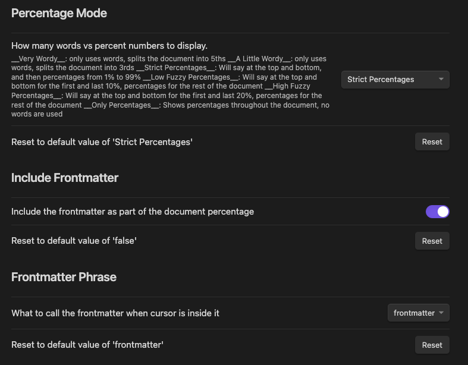

# Cursor Location  
This plugin for [Obsidian](https://obsidian.md/) displays the location of the
cursor (character and line number).

Currently, the plugin is Desktop Only because the mobile apps do not support custom status bar items.

## Demo
This demo uses an older version of Obsidian, but the output functions the same.

## Settings
`custom` options in dropdowns allow you to set your own pattern if none of the predefined ones suit your needs. For settings that used to be text boxes and are now dropdowns, if you've modified that setting from the previous default and would like to switch back, selecting `custom` will revert to your setting.

You can change the behavior via the Settings Tab.
- `# of Cursors`: Number of cursor positions that will display before switching
    to "N cursors"
- `Cursor Seperator`: String to seperate multiple curor locations when
    `# of Cursors` is greater than 1. Consecutive whitespace is squashed to 1
    space (per HTML rules).
  - This will only display if you have `# of Cursors` greater than 1
- `Selection Mode`: How to display cursor position when a selection is made
  - `Beginning`: Show where cursor started
  - `End`: Show where a cursor is currently
  - `Full Selection`: Shows the range of the selection (`ch:line -> ch:line`).
      This will display a range that may go from later in the document to earlier
      if the selection is dragged backwards.
- `Range Seperator`: String to seperate the beginning and end of a selection
    when `Selection Mode` is set to `Full Selection`. Consecutive whitespace is
    squashed to 1 space (per HTML rules).
- `Display as Percent`: Displays percent thru the document instead of what line
  number you are currently on.
- `Percentage Mode`: How many words vs percent numbers to display
  - `Very Wordy`: only uses words, splits the document into 5ths
  - `A Little Wordy`: only uses words, splits the document into 3rds
  - `Strict Percentages`: Will say at the top and bottom,
      and then percentages from 1% to 99%
  - `Low Fuzzy Percentages`: Will say at the top and bottom for the first
      and last 10%, percentages for the rest of the document
  - `High Fuzzy Percentages`: Will say at the top and bottom for the first
      and last 20%, percentages for the rest of the document
  - `Only Percentages`: Shows percentages throughout the document, no words are used
- `Individual Cursor Pattern`: Pattern to display location information for each cursor
  - `ch` is the column the cursor is at in the current line
  - `ln` is the current line number
  - `ct` is the total line numbers in the file (count)
  - If `ct` is the first or last of the three values, it will be removed when
    displaying a range.
- `Include Frontmatter`: Count the frontmatter as part of the document percentage
- `Frontmatter Phrase`: If not including frontmatter, what should it be called.
  - `frontmatter`
  - `metadata`
  - `preamble`
- `Display Cursor Line Count`: Display the number of lines selected by each cursor.
- `Cursor Line Pattern`: Pattern to display when `Display Cursor Line Count` is enabled
  - `custom` allows you to set your own pattern if none of the predefined ones
    suit your needs
  - If you've changed this from the default previously and would like to switch back,
    selecting `custom` will pick that one.
- `Pad Status Bar`: Add padding to lessen the amount the status bar shifts
- `Padding Width`: Amount status bar will pad, only shows
    when `Pad Status Bar` is enabled
- `Display Character Count`: Display the total number of characters selected or not
- `Display Total Line Count`: Display the total number of lines selected or not
- `Reset`: Reset all values to the default settings

### Default Settings

### Percentage Settings

## Installation
You can install the plugin via the Community Plugins tab within Obsidian.
Just search for "Cursor Location"

## Contributing
Help is greatly appreciated. First check if there are any issues open that
relate to what you want to help with. Also feel free to make a pull request
with changes / fixes you make.

## License
[MIT License](https://opensource.org/licenses/MIT)
